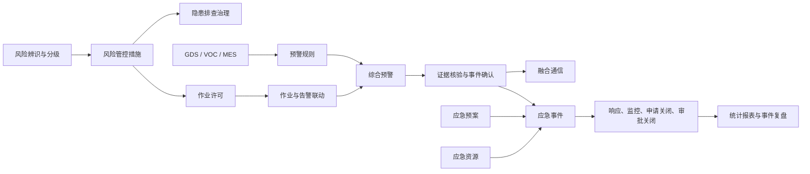
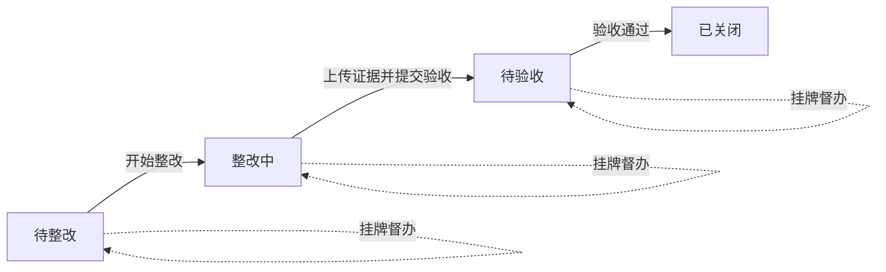
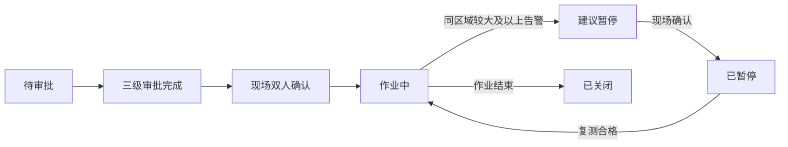
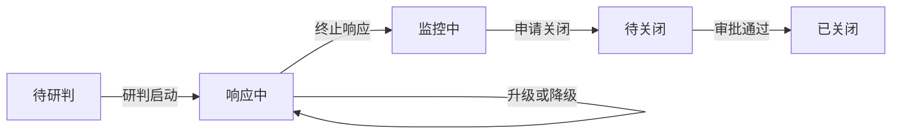

# QHSE 风险联动平台业务操作与客户讲解手册

> 文档版本：V1.1
>
> 对应系统版本：2026-07-18 代码版本
>
> 适用对象：售前顾问、实施人员、系统管理员、QHSE 管理人员、客户演示人员
>
> 使用目标：学完本手册后，能够独立完成系统演示，并向客户解释各界面的业务价值、操作方法和上下游关系。

---

## 1. 先掌握系统全貌

### 1.1 系统定位

QHSE 风险联动平台面向炼化企业的质量、健康、安全与环境一体化管理。系统不是单独展示台账，而是把以下业务串成闭环：

1. 辨识风险并落实管控措施。
2. 发现隐患并跟踪整改、验收和关闭。
3. 对高风险作业实施申请、审批、现场确认和监测联动。
4. 接入 GDS、VOC、MES 数据，按照规则形成预警。
5. 对预警进行证据核验、确认、处置和关闭。
6. 必要时启动应急响应，联动预案、通信、资源和事件处置。
7. 通过报表和诊断页面复盘管理效果及系统运行状态。



### 1.2 向客户介绍时使用的统一表述

现场讲解建议围绕三句话展开：

- 第一，系统把“静态台账”变成“动态风险”。设备监测、工艺异常、作业活动会共同影响现场风险判断。
- 第二，系统把“发现问题”变成“责任闭环”。每个业务对象都有责任人、状态、操作记录和权限控制。
- 第三，系统把“单点应用”变成“联动处置”。监测、规则、预警、作业票、通信、预案、资源和事件可以沿同一条业务链路协同。

### 1.3 当前版本能力边界

现场演示应实事求是。当前版本中，风险、隐患、作业许可、监测接入、规则、预警、应急事件、事件复盘、预案、资源、通信、报表、平台配置、权限管理和运行诊断已有前后端业务能力。以下内容属于展示、模拟或待项目化集成能力：

- 电话、短信、广播和 App 推送当前展示发送及升级过程，真实通信网关需要在项目实施时对接。
- GIS 厂区地图、人员定位、实时风场的部分数据为场景化展示，真实数据需对接客户 GIS 和定位系统。
- 应急指挥页主要承担态势展示和协同指挥，正式的事件响应等级变更与关闭以“事件闭环”页面为准。
- 登录页的手机号方式属于界面模板，业务演示统一使用账号密码登录。
- 默认开发环境使用内存数据，后端重启后会恢复种子数据；生产落地应配置 PostgreSQL 等持久化设施。

客户问到上述功能时，可回答：“平台已经预留业务位置和集成边界，具体网关、GIS、定位和生产数据源需要结合企业现有系统完成项目化接入。”

---

## 2. 演示环境准备

### 2.1 启动系统

首次使用先在项目根目录安装依赖：

```bash
npm install
```

打开两个终端。

终端一启动后端：

```bash
npm run server:dev
```

终端二启动前端 API 模式：

```bash
npm run dev
```

浏览器地址以终端输出为准，通常为 `http://localhost:8000`。后端服务默认监听 `http://localhost:3001`。

> `npm start` 会进入前端 Mock 演示模式。需要演示后端持久化操作、权限校验、附件上传、异步导出和诊断数据时，应使用 `npm run dev`，并确保后端已启动。

### 2.2 演示账号

所有演示账号的密码均为 `ant.design`。

| 账号           | 姓名/角色           | 数据范围     | 建议演示内容                         |
| -------------- | ------------------- | ------------ | ------------------------------------ |
| `admin`        | 系统管理员          | 全部区域     | 权限管理、平台配置、诊断、跨角色兜底 |
| `leader`       | 刘总 / 企业领导     | 全部区域     | 驾驶舱、报表、负责人审批             |
| `qhse`         | 赵磊 / QHSE 管理员  | 全部区域     | 风险、隐患、规则、预案、QHSE 审批    |
| `dispatcher`   | 陈涛 / 生产调度     | 全部区域     | 预警处置、生产负责人审批、应急与通信 |
| `unit_manager` | 李建国 / 装置负责人 | 催化裂化装置 | 属地审核、风险评估、现场业务         |
| `operator`     | 王强 / 岗位人员     | 催化裂化装置 | 隐患上报、整改、现场确认             |
| `environment`  | 周敏 / 环保管理员   | 硫磺回收装置 | VOC、环保业务、属地操作              |
| `commander`    | 马会军 / 应急指挥员 | 全部区域     | 应急指挥、资源调度、融合通信         |

### 2.3 登录与会话说明

1. 打开登录页。演示环境可选择“账户密码登录”，输入演示账号和统一密码。
2. 客户环境启用企业身份源后，点击“企业统一登录”，在企业认证页面完成登录；认证成功后自动返回系统并进入综合驾驶舱。
3. 如果登录页只显示企业登录，表示管理员已关闭本地账号密码入口，不是页面故障。
4. 企业身份只负责证明“你是谁”，菜单、按钮、角色和区域范围仍由本系统权限管理决定；企业账号声明必须匹配一个已启用的本地 IAM 账号。
5. 当前会话有效期为 8 小时，同一账号保留最近 5 个会话。
6. 若按钮置灰，通常表示当前账号没有该操作权限；若列表数据较少，可能是该账号只允许查看所属区域。

### 2.4 正式演示前检查清单

- 前后端终端均无报错。
- 使用 `qhse` 登录一次，确认驾驶舱有数据。
- 打开“运行诊断”，确认 API、存储和核心路由可访问。
- 打开“预警规则”，确认准备演示的规则为“已发布、已启用”。
- 为需要双人操作的流程准备两个不同账号，不要在同一账号上连续完成互斥签署。
- 大屏演示前将浏览器缩放恢复为 100%，建议使用 1920×1080 分辨率。
- 如需展示附件，提前准备一张现场图片或一个小型 PDF 文件。

---

## 3. 通用操作规则

### 3.1 页面结构

多数页面由四部分构成：

1. 顶部指标：快速说明当前风险、数量和完成率。
2. 筛选区：按状态、区域、类型或关键词缩小范围。
3. 对象列表：选择需要查看或处理的风险、隐患、票证、规则或事件。
4. 详情及操作区：查看证据、流程和时间线，并根据权限执行操作。

### 3.2 权限与数据范围

系统同时控制“能看什么”和“能做什么”：

- 菜单权限决定账号是否能进入某个能力域。
- 按钮权限决定能否新建、审批、整改、关闭或配置。
- 区域权限决定能看到哪些装置的数据。
- 后端会再次校验权限和区域，不能通过修改前端请求绕过。

现场话术：

> 平台不是所有人看同一套数据、点同一组按钮。岗位人员聚焦属地区域和现场执行，QHSE 人员负责专业管理，调度和领导负责审批与指挥，系统管理员负责平台配置。前后端双重校验能够保证职责边界。

### 3.3 并发更新与刷新

业务对象带有版本号。如果两个人同时操作同一对象，后提交的一方可能收到“版本冲突，请刷新后重试”。此时重新加载页面，核对最新状态后再操作。这是为了避免旧页面覆盖新结果。

### 3.4 状态颜色的理解

- 绿色：正常、已完成、已发布或已关闭。
- 蓝色：处理中、运行中或已确认。
- 橙色：待处理、临期、较大风险或需要关注。
- 红色：重大风险、严重告警、逾期或异常。
- 灰色：停用、离线、已结束或无权限。

具体状态应以文字为准，颜色只用于快速识别。

---

## 4. 综合驾驶舱

### 4.1 业务定位

综合驾驶舱是管理层和调度人员的总览入口，用于回答四个问题：现在总体风险如何、哪里有异常、哪些事项还未闭环、应急能力是否可用。

### 4.2 界面功能

- 顶部 KPI：企业综合风险、GDS 在线率、活动预警、VOC 达标情况、MES 异常和通信送达情况。
- 厂区态势图：按装置区域显示风险和事件分布，点击区域可切换右侧事件队列。
- 实时事件队列：显示预警等级、来源、区域和状态，点击事件进入预警详情。
- 60 分钟趋势：联合观察 GDS、VOC、MES 数据变化。
- 闭环概览：观察隐患、作业许可、预警和应急任务的进度。
- 应急摘要：展示当前预案、任务、资源和通信状态。
- “展示大屏”：进入全屏展示页面。

### 4.3 操作方法

1. 先看顶部 KPI，判断是否存在活动预警和异常指标。
2. 在厂区图上点击一个装置，观察事件列表是否随区域切换。
3. 在事件队列中选择一条预警，进入证据和处置详情。
4. 查看趋势图，解释监测指标与预警发生时间的关系。
5. 点击刷新按钮重新获取全局数据。
6. 需要快速展示联动时，可使用模拟告警入口；正式演示更建议在 GDS、VOC 或 MES 页面触发模拟数据。

### 4.4 客户讲解话术

> 驾驶舱把风险、监测、预警、作业和应急信息放在同一个业务视角里。领导看到的不只是数量，而是异常发生在哪个装置、处于什么状态、有没有关联作业、通知是否送达、资源是否到位，并且可以从总览直接下钻到业务详情。

---

## 5. 展示大屏

### 5.1 业务定位

展示大屏用于调度中心、领导参观和客户汇报，强调态势感知，不承担复杂表单操作。

### 5.2 界面功能

- 企业级风险、报警、监测在线率等关键指标。
- 厂区装置分布及风险状态。
- 监测趋势和实时告警列表。
- 应急预案、任务、资源、通信等联动态势。
- 手动刷新、返回驾驶舱和浏览器全屏。
- 页面可见时每 30 秒自动刷新；超过约 90 秒未成功更新会提示数据陈旧，刷新失败时会保留上一次数据并显示降级状态。

### 5.3 操作方法

1. 从驾驶舱点击“展示大屏”。
2. 点击全屏按钮，或使用浏览器全屏快捷键。
3. 从左到右、从上到下讲解风险、装置、趋势、告警和应急态势。
4. 需要核对最新数据时点击手动刷新。
5. 点击返回按钮回到驾驶舱。

### 5.4 客户讲解话术

> 大屏是指挥和展示视图，数据来自各业务域汇总。即使某次刷新失败，系统也不会把屏幕清空，而是保留最近一次成功快照并提示数据时效，避免值守人员误认为现场没有数据。

---

## 6. 风险分级管控

### 6.1 业务定位

风险分级管控用于建立风险单元、开展 LEC 评估、维护管控措施，并结合 GDS、VOC、MES、作业许可等动态因素调整当前风险等级。

### 6.2 界面功能

- 风险单元总数、高风险数量、动态升级数量、监测关联数量。
- 按风险等级筛选、按名称或编号搜索、按组织区域浏览。
- 静态等级与当前等级对比。
- 责任人、危险介质、事故类型、现场图片等风险档案。
- GDS、VOC、MES、预案等关联对象。
- 动态升级因素及风险变化说明。
- 管控措施清单及“有效、待验证”等状态。
- LEC 全量评估历史、评估/审批人员、依据、意见和时间。

### 6.3 LEC 评估规则

系统按照 `D = L × E × C` 计算风险值：

- L：事故发生可能性。
- E：人员暴露频次。
- C：事故后果严重性。
- D＜70：低风险。
- 70≤D＜160：一般风险。
- 160≤D＜320：较大风险。
- D≥320：重大风险。

### 6.4 操作方法：开展风险评估

1. 在左侧选择风险单元。
2. 点击“风险评估”。
3. 分别填写 L、E、C 数值。
4. 填写评估依据和评估说明。
5. 提交后评估进入“待审批”，此时当前风险等级不会改变。
6. 使用另一名具备风险审批权限的账号进入同一风险单元，在评估历史中点击“批准”或“驳回”。
7. 批准可填写审批意见，确认后新等级生效；驳回必须填写原因，当前等级保持不变。
8. 服务端以当前登录账号记录评估人和审批人，同一账号不能评估后再审批本人记录。

### 6.5 操作方法：维护管控措施

1. 选择风险单元，进入管控措施区域。
2. 点击“维护措施”。
3. 填写措施内容、责任人和执行状态。
4. 将新措施设置为“待验证”，现场落实并确认有效后再更新为“有效”。
5. 返回详情核对措施清单和更新时间。

### 6.6 客户讲解话术

> 一个风险点同时保留固有风险和当前动态风险。人工 LEC 评估提交后不会直接改等级，必须由另一名授权人员复核批准；所有评估、驳回和生效记录都保留在同一历史档案。这样既能解释“为什么升级”，也能明确“谁评估、谁复核、依据是什么”。

### 6.7 注意事项

- 同一风险单元存在待审批评估时不能再次提交；先由另一账号批准或驳回。
- `unit_manager` 可评估所属区域，`qhse` 可全厂评估和审批，`leader` 可审批；评估本人记录时必须切换其他审批账号。
- 风险等级不能只看颜色，应结合 LEC 分值、动态因素和现场实际判断。
- 没有“风险评估”“风险审批”或“维护措施”权限的账号只能执行其获授权的操作。

---

## 7. 隐患排查治理

### 7.1 业务定位

隐患治理覆盖发现、上报、整改、证据留存、验收、关闭和挂牌督办全过程。

### 7.2 状态流程



### 7.3 界面功能

- 未闭环、挂牌督办、逾期、重复隐患、已关闭等指标。
- 按状态筛选和按关键词搜索。
- 隐患等级、来源、类别、责任部门、责任人和整改期限。
- 隐患描述、整改措施和关联风险单元。
- 重复隐患自动识别、历史复发次数和根因治理提示。
- 整改前、整改中、整改完成等阶段证据。
- 操作时间线、每日幂等催办记录和验收意见。

### 7.4 操作方法：上报隐患

1. 点击“上报隐患”。
2. 填写隐患标题，选择关联风险单元。
3. 选择一般、较大或重大等级。
4. 选择来源：现场检查、预警转化、专项检查或复盘整改。
5. 填写类别、责任部门、责任人、发现时间和整改期限。
6. 填写隐患描述及建议整改措施。
7. 提交后，系统在同一风险单元和同一隐患类别内比对历史标题；达到相似度阈值时提示识别到的历史同类隐患数量。
8. 新隐患状态进入“待整改”；同类数量同步显示为“复发 N 次”，应结合历史整改记录开展根因分析，不能只重复原整改措施。

### 7.5 操作方法：整改与验收

1. 由有整改权限的人员点击“开始整改”，状态变为“整改中”。
2. 点击“添加证据”。手机或平板可点击“拍摄现场照片”直接调用后置摄像头；电脑可点击“选择已有文件”。
3. 拍摄完成后先核对照片预览。系统自动生成包含拍摄时间的证据名称和说明，并根据当前隐患状态推荐“整改前、整改过程、整改完成”阶段，操作人可以按实际情况修正。
4. 点击“归档证据”，等待照片上传完成。至少上传一项证据后才能提交验收。
5. 验收人员查看隐患内容、整改措施和附件。
6. 填写验收意见并确认，状态变为“已关闭”。

API 模式上传的文件会计算 SHA-256 摘要，用于证明附件内容未被替换。附件下载同样受权限控制。

移动端拍摄依赖浏览器摄像头权限；首次使用时应选择“允许”。系统支持 JPEG、PNG 和 WebP，单个附件默认不超过 20 MB。拍摄前应确认画面包含设备位号、问题部位和必要参照物，避免只拍局部而无法验收。

重复隐患识别属于辅助决策：系统采用风险单元、类别和标题文本进行保守匹配，不替代专业人员判断。标题应明确写出设备位号、部位和异常现象；标题过于笼统会降低识别效果。

### 7.6 挂牌督办

对重大、逾期或反复出现的隐患，可点击“挂牌督办”。完成重点跟踪后，再执行解除督办。督办不替代整改和验收，它是在原状态流程上增加管理关注。

具备督办权限的账号可点击“执行催办扫描”。系统会检查三日内到期和已逾期的未关闭隐患，在流转记录中生成“整改催办”；同一隐患同一天重复扫描不会重复记录。生产环境可启用后台周期扫描，页面按钮主要用于上线核对和人工补偿。当前催办已形成可追踪的系统任务，电话、短信或 App 的真实送达需继续对接客户消息网关。

### 7.7 客户讲解话术

> 隐患不是填一条记录就结束。系统要求明确责任和期限，用现场证据证明整改过程，再由有权限的人员验收关闭。临期和逾期隐患会自动形成每日催办轨迹，重大隐患还可以挂牌督办，整个过程保留操作者和时间记录。

---

## 8. 作业许可管理

### 8.1 业务定位

作业许可管理覆盖动火、受限空间、高处、吊装和临时用电五类作业，核心是“三级审批、现场双人确认、监测联动暂停”。

### 8.2 状态流程



### 8.3 申请作业票

1. 点击“申请作业票”。
2. 选择作业类型和作业区域。
3. 填写现场监护人、计划开始和结束时间。
4. 选择作业风险等级。
5. 关联同区域 GDS 探测器。
6. 填写作业点 X、Y 坐标。当前为百分比坐标，后续可由 GIS 平面图点选替代。
7. 填写作业内容、气体检测结果和安全措施。
8. 提交后，申请人自动记录为当前登录账号。

### 8.4 三级审批

审批必须按顺序完成：

| 审批节点   | 可执行角色                         | 推荐演示账号                    |
| ---------- | ---------------------------------- | ------------------------------- |
| 属地审核   | 装置负责人、环保管理员、系统管理员 | `unit_manager` 或 `environment` |
| QHSE 审核  | QHSE 管理员、系统管理员            | `qhse`                          |
| 负责人批准 | 企业领导、生产调度、系统管理员     | `leader` 或 `dispatcher`        |

操作时打开同一票证，点击“由当前账号签署·当前节点”。签署完成后系统记录签署人、时间和电子签名文本。

### 8.5 现场双人确认

三级审批全部通过后，需要完成“作业负责人”和“现场监护人”两项确认：

1. 第一个账号确认其中一个现场角色。
2. 退出并切换到另一个具备现场确认权限的账号。
3. 打开同一票证，确认另一个现场角色。
4. 两项确认完成后，票证进入“作业中”。

同一账号不能同时确认两个现场角色，这是强制双人复核控制。

### 8.6 告警联动与暂停

1. 确保存在“作业中”的票证，并关联同区域 GDS 探测器。
2. 确认“高风险作业告警联动”规则已发布并启用。
3. 在 GDS 页面触发同区域二级报警；API 模式会由服务端规则执行器自动生成暂停建议。
4. 回到作业许可页。页面会加载服务端最新结果，也可以点击“刷新联动结果”再次核对。
5. 匹配票证状态变为“建议暂停”。
6. 现场负责人确认暂停，票证进入“已暂停”。
7. 现场排查并重新检测气体。
8. 输入复测合格结果，恢复为“作业中”。

### 8.7 客户讲解话术

> 作业票不是孤立审批单。系统把作业位置、关联探测器和实时告警放在一起。当同区域出现较大告警时，系统先生成暂停建议，由现场人员确认执行；风险解除并复测合格后才能恢复，既体现自动识别，也保留人的最终确认责任。

### 8.8 注意事项

- 当前页面提供审批、现场确认、暂停和恢复操作；服务端已具备关闭能力，但当前界面没有独立的“关闭作业票”按钮。
- API 模式的联动在新预警信号生成时自动执行。“刷新联动结果”只读取服务端最新票证、点位、规则和信号，不会把已经存在的历史预警重新执行一遍。
- 开始时间必须早于结束时间。
- 不同区域账号不能审批或确认其数据范围之外的作业票。

---

## 9. 实时监测

实时监测包含 GDS、VOC 和 MES 三个界面。演示重点不是单独读数，而是数据如何进入规则、形成预警并联动作业与应急。

### 9.1 GDS 气体检测

#### 界面功能

- 按区域和状态筛选探测器。
- 显示点位编号、名称、实时浓度、趋势、在线状态和告警等级。
- 状态包括正常、一级、二级、趋势异常、离线和故障。
- 演示阈值图例：25%LEL 为一级，40%LEL 为二级，实际项目按企业标准配置。
- 点击告警点位可进入关联预警。

#### 操作方法

1. 选择装置区域，观察点位矩阵。
2. 查看点位浓度、趋势和在线状态。
3. 点击“模拟 GDS 二级报警”。
4. 系统写入模拟监测样本，并按已启用规则判断是否生成预警。
5. 点击告警点位或进入综合预警查看结果。

### 9.2 VOC 环保监测

#### 界面功能

- 展示入口、RTO 和出口等治理设施链路。
- 显示浓度、流量、治理效率及达标状态。
- 状态包括达标、预警、超标和离线。
- 支持模拟 VOC 超标样本并触发规则。

#### 操作方法

1. 观察治理设施前后浓度，解释治理效率。
2. 点击“模拟 VOC 超标”。
3. 查看点位状态变化。
4. 进入综合预警核对新产生的环保预警。

### 9.3 MES 工艺监测

#### 界面功能

- 以进料、加热、分馏、输送等工艺步骤展示参数。
- 显示当前值、上下限、趋势及异常状态。
- 支持 GDS 与 MES 组合分析。
- 支持模拟工艺参数异常和气体报警同时发生。

#### 操作方法

1. 查看各工艺参数是否在上下限内。
2. 点击“模拟 GDS + MES 联合异常”。
3. 系统向催化裂化装置写入相近时间的 MES 压力与 GDS 浓度样本，并自动计算 GDS 上升趋势。
4. 同一区域的两个来源指标在规则时间窗口内合并，页面出现联合预警入口后，可进入综合预警查看服务端信号和证据。

### 9.4 监测演示注意事项

- 模拟写入需要 `telemetry:ingest` 权限，推荐使用 `qhse`、`dispatcher` 或 `environment` 等具备相应权限的账号。
- 对应预警规则必须已经发布并启用，否则数据只会被接收，不会产生预警。
- 持续时间规则可能需要多个连续样本，不能用一个瞬时样本代表真实持续超限。
- 当前模拟按钮用于验证联动链路，不代表真实仪表接入方式。生产环境通常通过 MQTT、HTTPS 等接口接入。

### 9.5 客户讲解话术

> 监测页面同时关注数值、趋势、设备在线状态和业务上下文。平台不仅判断单点越限，还可以把不同系统在相近时间的异常组合成更有意义的联合预警，减少只看单个信号带来的误判。

---

## 10. 预警规则配置

### 10.1 业务定位

预警规则用于定义“什么数据、满足什么条件、持续多久、在哪个区域、通知给谁”。规则变更采用草稿和双人会签，避免未经审核的阈值直接影响生产告警。

### 10.2 界面功能

- 按 GDS、VOC、MES、联合分析和作业许可筛选。
- 统计规则总数、已启用数、待审批数和累计触发数。
- 配置规则编码、名称、来源、场景、等级、作用域和说明。
- 通过指标、比较符、阈值、AND/OR 组合表达式。
- 配置持续时间、灰度比例和通知对象。
- 冲突检测、测试样本、启停、版本历史、版本对比和回滚草稿。

### 10.3 新建或编辑规则

1. 点击新建规则，或选择现有规则后点击“编辑规则”。
2. 填写唯一规则编码。创建后编码不能修改。
3. 选择数据来源、业务场景、预警等级和作用区域。
4. 添加一个或多个条件，选择 AND 或 OR 关系。
5. 填写持续时间、灰度比例 25%/50%/100% 和通知对象。
6. 保存为草稿。
7. 检查页面是否提示同作用域、同表达式冲突。存在冲突时先调整规则，不能提交会签。

### 10.4 双人会签与发布

1. 草稿确认无误后点击“提交会签”。
2. 使用 `qhse` 完成“QHSE 会签”。
3. 切换 `dispatcher` 完成“生产负责人会签”。
4. 两个节点都通过后，规则形成新版本并发布。
5. 对已发布规则执行启用或停用。

同一账号不能连续完成两个会签节点。编辑已发布规则时，运行时仍使用原版本，直到新草稿会签发布。

### 10.5 测试与版本管理

- “执行测试样本”只对已发布、已启用且支持测试的数据源开放。
- 持续时间条件可能需要连续写入样本后才触发。
- 相同规则在抑制窗口内不会重复生成大量预警；当前抑制窗口为 5 分钟。
- “版本历史”可查看历次发布内容。
- 回滚历史版本只会生成一个新草稿，不会立即替换当前生效版本；仍需提交和会签。

### 10.6 客户讲解话术

> 规则管理采用“编辑不影响运行、会签后才发布”的机制。这样既允许业务人员持续优化阈值，又能保证生产环境始终有一个明确的生效版本。每次发布和回滚都留有版本记录。

---

## 11. 综合预警与预警详情

### 11.1 业务定位

综合预警统一接收 GDS、VOC、MES、联合分析及作业联动事件，支持从“信号”转为“经过证据核验的业务事件”。

### 11.2 预警中心界面

- 按等级统计活动预警。
- 按待确认、已确认、处置中、监控中等状态筛选。
- 按标题、区域或来源搜索。
- 显示事件等级、来源、发生区域、时间和当前状态。
- 点击预警卡片进入详情。

### 11.3 预警详情界面

- 监测数据：触发时的 GDS、VOC 或 MES 样本。
- 工艺参数：与事件相关的生产参数。
- 同区域作业票：判断是否存在高风险作业叠加。
- 相关人员与回执：查看通知和确认状态。
- 推荐预案、任务、通信和时间线。
- 证据核验、确认事件、启动应急响应和关闭预警操作。

### 11.4 推荐处置顺序

1. 打开预警详情，逐项查看监测、工艺、作业和人员证据。
2. 对关键证据点击“核验”。系统记录核验人和时间，同一证据不能重复核验。
3. 判断信号真实有效后，点击“确认事件”。
4. 需要应急处置时点击“启动应急响应”。系统会创建一个对应的应急事件，多次点击不会重复创建。
5. 转到“事件闭环”完成研判、响应和关闭流程。
6. 风险解除且不再需要跟踪时，填写关闭原因并关闭预警。

### 11.5 客户讲解话术

> 告警不能直接等同于事故。平台先汇聚证据，让值守人员核验监测值、工艺参数、同区域作业和人员回执，再确认是否转为业务事件。需要升级时，系统可以基于同一预警创建应急事件，避免重复录入。

### 11.6 注意事项

- 启动应急响应需要同时具备预警处置和应急管理权限。
- 关闭预警需要独立的关闭权限，并填写关闭原因。
- 已创建应急事件的预警再次点击启动，不会重复创建事件。

---

## 12. 融合通信

### 12.1 业务定位

融合通信用于跟踪“通知发给谁、通过什么渠道、是否送达、是否确认、未确认时如何升级”。

### 12.2 界面功能

- 活动事件和通知任务列表。
- App、电话、短信、广播等渠道状态。
- 接收人、发送时间、送达时间、确认时间、重试次数等审计信息。
- 升级链：0 分钟 App，2 分钟电话，3 分钟班组长，5 分钟应急指挥员。
- 推进下一升级节点和接收确认操作。
- 通知模板预览。

### 12.3 操作方法

1. 选择一个活动事件。
2. 查看当前通知任务和各接收人的送达状态。
3. 模拟未确认时，点击“推进下一升级节点”。
4. 观察渠道和接收对象按升级链变化。
5. 使用具备确认权限的账号点击确认。
6. 一旦收到有效确认，后续升级停止。

### 12.4 客户讲解话术

> 系统关注的不只是“已经发送”，而是“对方是否收到并确认”。如果关键岗位长时间未确认，通知会按照预设链路升级到更强渠道或更高层级，并保留发送、送达、确认和重试记录。

### 12.5 当前边界

当前版本通过演示适配器呈现通信发送和升级过程，电话、短信、App、广播的真实网关需在项目实施时接入。“试听模板”用于展示模板入口，当前没有真实语音播放服务。

---

## 13. 应急预案

### 13.1 业务定位

应急预案库统一管理综合应急预案、专项应急预案、现场处置方案和岗位应急处置卡，并覆盖版本、会签、生效、到期和演练。

### 13.2 界面功能

- 按预案类别、发布状态和关键词筛选。
- 统计预案总数、生效数、待评审数、临期数和演练计划数。
- 查看触发规则、事件类型、介质、响应等级和适用区域。
- 查看处置步骤、通知对象和资源清单。
- 草稿、双人会签、发布及历史版本。
- 演练计划、开始、复盘评分和问题记录。

### 13.3 新建与发布预案

1. 点击“新建预案”。
2. 填写编码、名称、类别、响应等级、事件类型和涉及介质。
3. 填写适用区域、责任部门、生效日期和到期日期。
4. 填写触发规则。
5. 按顺序录入通知对象、处置步骤和资源清单。
6. 保存草稿。
7. 点击“提交会签”。
8. 使用 `qhse` 完成“QHSE 评审”。
9. 切换 `dispatcher` 完成“生产负责人会签”。
10. 会签完成后预案发布并进入生效状态。

编辑已发布预案会产生独立草稿，原版本继续生效。历史版本回滚同样先生成草稿，再走会签。

### 13.4 演练管理

1. 选择预案，点击“安排演练”。
2. 填写演练名称、桌面推演/专项演练/综合演练类型、时间、地点、负责人和参与人员。
3. 到期后点击“开始”。
4. 演练结束后填写复盘评分、总结和问题清单。
5. 提交后形成已完成的演练记录。

### 13.5 客户讲解话术

> 预案不是静态 PDF。系统把触发条件、步骤、通知对象和资源清单结构化，发生事件时可直接用于匹配和指挥。版本更新先形成草稿并会签，避免编辑过程中影响当前有效预案；演练结果又可以反向推动预案修订。

---

## 14. 应急资源

### 14.1 业务定位

应急资源管理覆盖消防、气防、医疗和物资四类资源，重点管理库存批次、有效期、检查状态、调拨、到位和归还。

### 14.2 界面功能

- 资源总数、库存占用、可立即调拨数、到期和检查关注项。
- 综合战备率：有可用库存且检查状态正常的资源占比。
- 按类别、待命/调度中/已到位状态和关键词筛选。
- 资源编号、位置、责任人、联系方式、预计到场时间和下次检查日期。
- 批次、有效期、可调数量、巡检和全过程记录。

### 14.3 登记资源与批次

1. 点击“新增资源”。
2. 填写唯一资源编号、名称、类别、单位、位置、责任人、联系方式、预计到场时间等信息。
3. 同时填写首批次号、入库数量、入库日期、有效期和首次检查期限。
4. 保存后如需追加库存，进入资源卡片点击“批次”。
5. 填写新批号、数量、入库日期和有效期。
6. 系统按批次判断正常、即将到期和已过期状态。

调拨时优先使用较早到期且仍有效的批次。已过期库存不计入可调数量。

### 14.4 巡检

1. 在资源卡片点击“巡检”。
2. 填写检查人、检查结果、下次检查日期和备注。
3. 检查结果可为检查合格、即将到期或需要维护。
4. 需要维护的资源不能调拨，处理完毕后重新巡检为合格。

### 14.5 调拨、到位和归还

1. 点击“调拨”，选择或填写关联事件。
2. 填写目的地、调拨数量和操作人。
3. 提交后库存被占用，状态变为“调度中”。
4. 资源到达现场后点击“确认到位”。
5. 事件结束后点击“归还”，库存恢复可用。
6. 点击“记录”查看调拨、到位、归还和巡检历史。

### 14.6 客户讲解话术

> 应急资源管理不只统计总库存。平台同时考虑批次有效期、检查状态、已占用数量和运输状态，回答“现在真正能调多少、从哪里调、多久到、是否已经到位”。

---

## 15. 应急指挥

### 15.1 业务定位

应急指挥页用于突发事件过程中的态势展示和协同，集中呈现事件、预案、警戒区、人员、作业、任务、资源和通信状态。

### 15.2 界面功能

- 当前事件、响应等级、指挥员和处置进度。
- 厂区地图、警戒区、集合点、风向和周边风险信息。
- 同区域作业票和现场人员摘要。
- 匹配预案及关键处置步骤。
- 任务执行进度、资源调拨状态和通信确认情况。

### 15.3 操作方法

1. 从生效预案点击“进入应急指挥台”，或从菜单进入。
2. 先讲事件级别、区域和当前态势。
3. 结合地图说明警戒区、集合点和周边作业。
4. 展开预案步骤，说明现场处置顺序。
5. 查看任务、资源和通信模块，说明跨部门协同状态。
6. 需要正式变更响应等级或结束事件时，转到“事件闭环”页面操作。

### 15.4 客户讲解话术

> 指挥台把分散在预案、资源、通信和作业许可中的信息汇聚到事件视角。指挥人员可以快速了解影响范围、人员确认、任务进度和资源到位情况。当前页面侧重态势展示，正式事件状态以事件闭环流程为准。

### 15.5 当前边界

部分风向、人员和现场标签为演示场景数据；页面上的部分任务推进属于指挥视图交互。客户项目应接入真实气象、人员定位和 GIS 数据，并以服务端事件任务为权威记录。

---

## 16. 事件闭环

### 16.1 业务定位

事件闭环是应急事件的权威业务流程，负责研判启动、响应等级调整、终止响应、监控、申请关闭和审批关闭。

### 16.2 状态流程



响应等级从低到高为 IV 级、III 级、II 级、I 级。升级和降级都需要结合现场态势和预案条件判断。

### 16.3 事件处置操作

1. 选择“待研判”事件，核对来源预警和现场证据。
2. 点击“研判启动”，事件进入“响应中”。
3. 根据影响范围和处置情况执行升级或降级。
4. 上传现场照片、监测报告、处置记录或审批材料。
5. 应急处置结束后点击“终止响应”，进入“监控中”。
6. 确认现场稳定后点击“申请关闭”，系统生成关闭审批任务。
7. 使用另一个具备审批权限的账号打开该事件。
8. 核对至少一项事件证据，填写审批意见和电子签署信息，批准关闭。
9. 事件关闭成功后，系统自动生成对应事件复盘档案，可直接进入“事件复盘”继续调查和整改。

申请人与关闭审批人原则上必须是不同账号，关闭审批节点由 QHSE 角色办理；系统管理员仅用于管理兜底。待关闭工作流按 4 小时跟踪，可发送提醒并标记超时。

### 16.4 证据与审计

- 支持现场照片、监测报告、处置记录和审批材料分类上传。
- API 模式会计算文件摘要，下载受权限控制。
- 时间线记录状态变化、操作人和操作时间。
- 版本冲突时需要刷新后重新判断，不能用旧页面覆盖最新状态。

### 16.5 客户讲解话术

> 从预警启动应急后，事件进入独立闭环。研判、响应级别、终止响应、监控和关闭审批都有明确状态。申请关闭与审批关闭由不同人员完成，并要求事件证据，防止事件在没有处置依据的情况下直接结束。

---

## 17. 事件复盘

### 17.1 业务定位

事件复盘用于还原事件时间线、分析直接原因和根本原因、形成经验教训，并跟踪改进项直到归档。

### 17.2 界面功能

- 事件处置时间线。
- 直接原因、根本原因和经验教训。
- 复盘负责人和参与部门。
- 改进项优先级、责任人和状态。
- 改进项从待整改、整改中到已完成的推进。
- 改进项转隐患、隐患编号和治理状态回写。
- 历史复盘、关闭隐患和生效预案的相似案例检索。
- 服务端生成的正式复盘报告下载。
- 全部改进项完成后关闭和归档复盘。

### 17.3 操作方法

1. 选择已经结束的事件。
2. 按时间检查预警、确认、响应、处置和结束节点。
3. 点击“编辑调查结论”，维护事件摘要、直接原因、管理根因及经验教训。
4. 点击“归档调查附件”，上传调查报告、现场照片、检测报告或培训记录；系统计算文件哈希并记录上传人。
5. 点击“新增整改措施”设置措施、责任部门、责任人、完成期限和优先级；未完成措施可点击“调整”修改责任和期限。
6. 对需要进入隐患治理闭环的措施点击“转为隐患”，选择事件所属区域的风险单元、隐患等级和类别后生成隐患任务。
7. 转单后页面显示隐患编号，点击“查看隐患”进入隐患治理；关联措施不再允许在复盘页手工调整或推进。
8. 在隐患治理中完成开始整改、证据上传、提交验收和验收关闭，再回到复盘页点击“同步隐患状态”。
9. 隐患待整改对应措施待整改，整改中或待验收对应措施整改中，隐患已关闭对应措施已完成。
10. 未转为隐患的简单措施仍可在复盘页直接推进，直到全部改进项完成。
11. 使用具备 `emergency:approve` 权限的 QHSE 账号完成关闭并归档复盘。
12. 点击“查相似案例”，输入不少于 2 个字的事故类型、设备、介质或原因，例如“法兰泄漏”。
13. 可选择事件复盘、隐患案例或应急预案类型；系统只返回已归档复盘、已关闭隐患和已发布生效预案，并按相关度排序。
14. 检索结果显示知识类型、编码、标题、摘要、所属区域、状态、相关度和匹配内容；属地账号不会检索到授权区域外的复盘或隐患。
15. 使用具备 `report:export` 权限的账号点击“导出复盘报告”，下载包含调查结论、时间线、整改措施、隐患编号和证据哈希目录的 HTML 报告。
16. 在浏览器打开报告后可直接打印，选择“另存为 PDF”即可形成便于对外归档的 PDF 版本；未归档报告会显示“待归档”水印。

### 17.4 当前边界

API 模式下，应急事件关闭后会自动建立复盘档案；调查结论、调查附件、整改计划维护、隐患转单及状态同步、正式知识检索、报告导出、可信操作人、区域权限、乐观锁和关闭归档均由服务端执行。转单同时要求 `emergency:manage` 与 `hazard:report`，风险单元与事件区域不一致时服务端拒绝创建；知识检索要求复盘、隐患和预案三类读取权限，报告导出同时要求 `emergency:read` 与 `report:export`。当前检索范围是结构化业务字段，尚未解析附件正文，也未接入 OCR、全文索引或向量语义检索。

---

## 18. 统计报表

### 18.1 业务定位

统计报表用于按时间和授权区域观察隐患、预警、作业许可、应急事件的数量、闭环率和区域风险排序。

### 18.2 界面功能

- 日期范围和区域筛选。
- 隐患、预警、作业许可、应急事件指标及完成率。
- 近 30 天趋势。
- 区域风险指数排序和明细。
- 异步生成 CSV、查看任务状态和下载文件。

### 18.3 操作方法

1. 选择开始和结束日期，结束日期不能晚于当前日期。
2. 选择授权范围内的区域，或查看全部授权区域。
3. 点击刷新，查看指标和趋势变化。
4. 点击导出，系统创建后台任务。
5. 等待任务从“排队中/生成中”变为“已完成”。
6. 点击下载 CSV。导出文件只能由创建任务的账号下载。

单次查询最长支持 366 天，CSV 使用 UTF-8 编码。

### 18.4 区域风险指数

当前报表排序指标为：

```text
未闭环隐患 × 2
+ 逾期隐患 × 3
+ 活动预警 × 2
+ 重大预警 × 5
+ 活动作业票
+ 未关闭应急事件 × 4
```

这个指数用于报表排序和管理关注，不替代法规或企业标准中的风险分级结论。

### 18.5 客户讲解话术

> 报表把不同业务域转换成同一时间和区域口径，既能看总量，也能看闭环率和趋势。区域风险指数用于快速发现管理关注区域，点击区域明细后仍要回到具体风险、隐患和事件判断原因。

---

## 19. 平台配置

### 19.1 业务定位

平台配置用于维护业务字典和外部系统集成登记。通常由系统管理员操作，普通业务人员只读或不可见。

### 19.2 数据字典

字典用于统一状态、类别、来源等基础选项。

操作方法：

1. 进入“数据字典”页签。
2. 新建字典时填写编码、名称、说明和状态。
3. 字典编码使用小写字母、数字和下划线，创建后不可修改。
4. 增加字典项，填写值、显示名称、排序、颜色和启用状态。
5. 同一字典内的值不能重复。
6. 保存后核对版本和更新时间。

### 19.3 集成登记

集成登记用于记录监测、通知、身份、存储等外部系统的非敏感连接信息。

操作方法：

1. 进入“集成登记”页签。
2. 填写唯一编码、名称和类别。
3. 选择 HTTP、HTTPS、MQTT 或 MQTTS 协议。
4. 填写非敏感接口地址、运维责任方和超时时间。
5. 选择启用或停用并保存。

地址中的协议必须与所选协议一致。禁止在地址中填写用户名、密码、Token、证书或密钥，敏感凭据应由部署环境或密钥管理系统注入。

### 19.4 客户讲解话术

> 平台把业务字典和集成登记集中管理，避免各模块各自维护同一套基础数据。集成页面只记录非敏感元数据，真正的密码和证书不进入业务数据库，降低敏感信息泄露风险。

### 19.5 注意事项

- 当前集成健康状态主要反映登记和运行信息，不等同于完整的第三方连接测试。
- 只有具备 `config:manage` 权限的账号可以修改，演示建议使用 `admin`。
- 当前页面没有删除操作，避免误删正在使用的配置。

---

## 20. 组织与权限管理

### 20.1 业务定位

组织与权限管理用于统一查看账号、组织、角色权限和区域数据范围，并通过双人审批维护已有账号授权。它解决“谁能看、谁能办、能看哪些区域，以及谁申请、谁复核”的平台治理问题。

### 20.2 界面功能

- 用户、角色、组织和区域数量总览。
- 按姓名、账号、组织和状态筛选用户。
- 展示每个账号的角色、数据范围、启停状态和授权版本。
- 修改账号状态、所属组织、授权角色和区域范围。
- 管理员重置临时密码并使目标账号现有会话失效。
- 新用户或密码重置后的首次登录强制设置本人新密码。
- 查看内置与自定义角色的权限矩阵、数据范围和已授权用户数。
- 创建自定义角色，维护角色名称、权限点和数据范围。
- 查看授权变更审批台账、待审批数量、拟变更内容、申请原因和审批结果。
- 由另一名管理员批准或驳回申请，使用用户版本和申请版本防止并发覆盖。

### 20.3 操作方法

新增用户：

1. 使用 `admin` 登录，进入“权限管理”。
2. 点击“新增用户”，填写小写登录账号、姓名、岗位和 8–72 位初始密码。
3. 选择所属组织和一个或多个角色。
4. 若所选角色为区域数据权限，至少选择一个区域；全企业角色无需选择区域。
5. 点击“创建用户”，新账号立即进入启用状态，可用初始密码登录。
6. 新账号登录后自动进入“设置新密码”，输入当前初始密码、本人新密码并确认。
7. 修改成功后使用新密码重新登录，才可进入业务页面。

调整已有用户：

1. 搜索目标账号，核对当前组织、角色、数据范围和状态。
2. 点击“授权”。
3. 选择启用或停用、所属组织和一个或多个角色。
4. 填写可追溯的变更原因，点击“提交审批”；此时当前授权尚未改变。
5. 使用另一名具备 `iam:manage` 权限的管理员账号登录，在“授权变更审批”找到该申请。
6. 核对申请对象、目标用户版本、拟变更角色和区域以及申请原因。
7. 点击“批准”并填写意见，或点击“驳回”并填写必填原因。
8. 批准成功后申请状态变为“已批准”，目标用户版本递增；被停用账号的现有会话立即失效，角色或区域调整立即作用于已有会话。
9. 若提示用户版本已变化，说明申请期间已有其他变更；先驳回旧申请，再按当前版本重新提交，禁止直接覆盖。

重置用户密码：

1. 在目标用户操作列点击“重置密码”。
2. 输入 8–72 位临时密码并确认重置。
3. 目标用户所有现有会话立即失效。
4. 将临时密码通过企业规定的安全渠道交给本人，不要在群聊或演示画面中公开。
5. 用户用临时密码登录后必须设置新密码，之后使用新密码重新登录。

创建和维护自定义角色：

1. 在“角色权限矩阵”点击“新增角色”。
2. 填写 3–50 位小写角色编码和角色名称；角色编码创建后不可修改。
3. 选择“全企业”或“授权区域”数据范围。
4. 从权限点列表选择该角色允许执行的业务操作，至少选择一项。
5. 点击“创建角色”，随后可在新增用户或用户授权弹窗中分配该角色。
6. 修改自定义角色时点击“编辑”，调整名称或权限点并保存；已登录用户会立即使用新权限。
7. 若角色已分配给用户，需先从相关用户授权中移除该角色，才能切换数据范围类型。

### 20.4 安全边界

- 只有具备 `iam:manage` 权限的账号能够保存授权。
- 申请人与审批人必须是不同账号；现场演示审批流程前应准备两个系统管理员账号。
- 当前管理员不能停用自身，也不能移除自己的系统管理员角色，避免把平台锁死。
- 页面支持创建、维护和重置账号密码，但任何列表与响应都不回显密码或密码摘要，也不提供账号删除。
- 强制改密期间只能查询本人、修改密码或退出登录，其他业务接口由后端统一拒绝；密码变化后全部旧会话立即失效。
- 当前密码规则只校验 8–72 位长度；复杂度、历史密码、防泄漏密码库和企业统一身份源策略仍需按客户制度接入。
- 八类内置角色只读，避免修改系统基线；自定义角色当前不提供删除，防止已有用户授权悬空。
- 管理页面已默认使用双人审批；兼容性直接授权接口仍存在，生产集成应限制其调用范围并以审批接口为标准路径。
- 多实例模式可通过 Redis 广播用户、密码、角色和审批变化，其他节点自动重载 PostgreSQL 权威快照；运行诊断页可查看广播状态与计数。
- 企业统一身份源已支持 OIDC 授权码 + PKCE；系统只映射已存在且启用的 IAM 账号，不会因企业登录自动创建用户或自动授予角色。
- 客户上线前需由身份管理员登记回调地址、配置稳定唯一账号声明并完成真实身份源联调；自动供给、企业组映射和单点退出尚未提供。
- 默认演示环境授权保存在进程内，后端重启后恢复种子授权；配置 `QHSE_REPOSITORY=prisma` 并初始化数据库后，授权写入 PostgreSQL 持久化保存。
- Prisma 模式上线本版本前必须同步新增的 `iam_authorization_requests` 表和审批状态枚举。
- 多实例生产部署必须同时配置 Prisma 仓储、Redis IAM 广播和 Redis 会话；仅开启其中一项不能保证跨节点权限一致。

### 20.5 客户讲解话术

> 平台权限不是只控制菜单显示，后端会对按钮操作和区域数据再次校验。高风险授权先由一名管理员申请，再由另一名管理员复核；批准时系统把申请、用户版本、角色和区域作为一个事务处理。授权生效后立即作用于现有会话，既避免单人误操作，也防止并发修改互相覆盖。

---

## 21. 运行诊断

### 21.1 业务定位

运行诊断面向系统管理员和运维人员，用于检查后端服务、存储、缓存、队列、会话、请求和集成登记的运行状态。

### 21.2 界面功能

- 服务节点、启动时间和运行时长。
- 日志和追踪标识。
- 数据仓储、对象存储、缓存、队列、会话、统一身份和 IAM 跨实例广播状态。
- IAM 广播发送、接收、重连校准和失败计数。
- 请求总量、错误数量、各路由调用量、平均耗时和高分位耗时。
- 进程内存等运行指标。
- 已登记集成的摘要。
- 每 15 秒自动刷新和手动刷新。

### 21.3 操作方法

1. 使用 `admin` 或有监控权限的账号进入运行诊断。
2. 先看总体服务和依赖状态。
3. 企业登录环境确认“统一身份”为“已启用/正常”；异常时先检查身份源发现地址、客户端登记和网络连通性。
4. 多实例环境确认 IAM 广播和统一身份流程存储均使用 Redis；若显示降级，暂停高风险授权操作并检查 Redis。
5. 检查请求错误数量是否持续增长。
6. 查看耗时较高或错误较多的路由。
7. 对比更新时间，确认页面仍在自动刷新。
8. 出现异常时记录节点、路由、时间和追踪标识，再交给运维人员排查。

### 21.4 客户讲解话术

> 诊断页提供轻量级运行可观测能力，帮助管理员快速判断问题在业务、接口还是基础设施。页面不展示密码、Token 和完整敏感地址。生产多实例环境仍建议接入 Prometheus、OpenTelemetry 和集中日志平台。

---

## 22. 推荐现场演示路线

### 22.1 30 分钟标准演示

| 时间       | 页面                     | 讲解重点                     | 推荐账号                 |
| ---------- | ------------------------ | ---------------------------- | ------------------------ |
| 0–3 分钟   | 登录、驾驶舱             | 系统定位、全局态势、权限     | `qhse`                   |
| 3–6 分钟   | 展示大屏                 | 领导视角和自动刷新           | `qhse`                   |
| 6–10 分钟  | 风险、隐患               | LEC、管控措施、整改证据闭环  | `qhse`                   |
| 10–14 分钟 | 作业许可                 | 三级审批、双人确认、告警暂停 | 准备好的票证             |
| 14–18 分钟 | GDS/MES                  | 模拟数据和联合异常           | `qhse`                   |
| 18–22 分钟 | 预警规则、预警详情       | 规则版本、证据核验、启动应急 | `qhse`/`dispatcher`      |
| 22–26 分钟 | 通信、应急指挥、事件闭环 | 通知升级、响应和审批关闭     | `dispatcher`/`commander` |
| 26–29 分钟 | 预案、资源、报表         | 战备、调度和管理统计         | `qhse`                   |
| 29–30 分钟 | 权限、平台配置、诊断     | 可治理、可配置、可运维       | `admin`                  |

### 22.2 重点闭环演示脚本

演示“监测异常到应急事件”时，按以下顺序执行：

1. 使用 `qhse` 登录，在预警规则确认 GDS 或联合规则已发布、已启用。
2. 进入 GDS 或 MES 页面触发模拟异常。
3. 进入综合预警，找到新事件并打开详情。
4. 核验监测、工艺和作业证据。
5. 确认事件并启动应急响应。
6. 进入融合通信，推进通知并模拟接收确认。
7. 切换 `dispatcher` 或 `commander`，进入事件闭环并完成研判启动。
8. 根据场景讲解响应升级、预案和资源调度。
9. 上传一项事件证据，终止响应并进入监控。
10. 由当前应急处置账号申请关闭，再切换 `qhse` 完成关闭审批。
11. 最后进入报表说明事件已进入统计口径。

### 22.3 作业许可完整演示脚本

1. 使用现场业务账号申请一张催化裂化装置作业票。
2. `unit_manager` 完成属地审核。
3. `qhse` 完成 QHSE 审核。
4. `dispatcher` 或 `leader` 完成负责人批准。
5. 使用 `unit_manager` 和 `operator` 分别完成两个现场角色确认。
6. 确认票证进入“作业中”。
7. 确认作业许可联动规则已发布并启用。
8. 在 GDS 监测页面触发同区域二级报警。
9. 返回作业许可页面，必要时点击“刷新联动结果”。
10. 核对票证已形成暂停建议。
11. 确认暂停，讲解现场停止作业。
12. 执行复测合格并恢复作业。

---

## 23. 客户常见问题与回答

### 23.1 系统能否接入现有 GDS、DCS、MES 和环保平台？

可以。当前平台已经按 GDS、VOC、MES 等来源建模，并支持 HTTP/HTTPS/MQTT/MQTTS 等集成登记。正式接入需要确认客户系统协议、数据字典、采样频率、时间同步、网络区划和安全认证方式。

### 23.2 规则调整会不会马上影响生产告警？

不会。编辑已发布规则时会生成草稿，当前版本继续运行。新草稿经过冲突检查和双人会签后才发布生效，回滚也走同样流程。

### 23.3 为什么一个人不能完成全部审批？

系统按照岗位职责实施职责分离。作业许可包含不同专业审批，规则和预案采用双人会签，作业现场双人确认、事件关闭申请与审批也要求不同人员，目的是避免单人自批自结。

### 23.4 告警和事件有什么区别？

告警是设备或规则产生的信号；预警详情通过多源证据进行核验；确认需要应急处置后，才创建正式应急事件。事件有独立的研判、响应、监控和关闭审批流程。

### 23.5 系统如何证明整改附件没有被替换？

API 模式上传附件时计算 SHA-256 摘要，并保存文件元数据、上传人和时间。后续可通过摘要比对识别内容变化。生产项目还可对接对象存储防篡改和电子签章。

### 23.6 大屏数据中断后会怎样？

大屏保留最近一次成功快照，并显示数据陈旧或降级提示，不会把旧数据伪装成实时数据，也不会因一次刷新失败显示空白。

### 23.7 当前数据是否永久保存？

默认开发演示环境使用内存存储，后端重启后恢复种子数据。代码已提供数据库适配方向，生产使用必须部署 PostgreSQL、对象存储、备份和灾备机制。

### 23.8 为什么按钮是灰色的？

通常是当前角色没有该操作权限，或对象状态不允许当前操作。例如没有完成三级审批时不能现场确认，事件没有进入监控中时不能申请关闭。可以查看状态并切换到匹配岗位账号。

### 23.9 为什么模拟监测后没有生成预警？

依次检查：

1. 后端是否启动，前端是否使用 API 模式。
2. 当前账号是否有监测写入权限。
3. 对应规则是否已发布并启用。
4. 规则作用区域和指标是否匹配模拟样本。
5. 是否设置了持续时间，需要多个连续样本。
6. 是否处于 5 分钟抑制窗口。

### 23.10 能否直接用于生产？

当前版本适合业务验证、原型演示和继续开发。生产上线前仍需完成真实数据源和通信网关接入、持久化配置、安全加固、性能容量验证、高可用、备份灾备、等保要求、用户组织同步和现场验收。

---

## 24. 常见操作故障处理

### 24.1 页面提示网络错误

1. 查看后端终端是否仍在运行。
2. 打开运行诊断确认 API 状态。
3. 检查前端是否通过 `npm run dev` 启动。
4. 刷新浏览器并重新登录。

### 24.2 登录后数据为空

- 检查账号的数据区域范围。
- 清除筛选条件。
- 确认后端已启动且完成种子数据加载。
- 事件复盘按区域数据范围返回；无权访问事件所在区域的账号会看到空列表，可切换 `qhse` 或对应装置负责人账号核对。

### 24.3 操作提示权限不足

- 核对当前用户名和角色。
- 按本手册账号表切换到正确岗位。
- 不建议现场为了方便统一使用管理员完成所有操作，否则无法体现职责分离。

### 24.4 操作提示版本冲突

重新加载列表或页面，查看他人刚完成的操作，再依据最新状态执行。不要连续重复点击提交按钮。

### 24.5 双人会签无法继续

检查是否仍使用第一个审批账号。退出后切换到另一个具备审批权限的账号，再打开同一对象完成下一节点。

### 24.6 附件无法上传或下载

- 确认当前为 API 模式，后端正常运行。
- 检查账号是否有附件上传或读取权限。
- 使用小型常见格式文件再次尝试。
- 查看浏览器和后端错误信息。

---

## 25. 术语速查

| 术语     | 解释                                           |
| -------- | ---------------------------------------------- |
| QHSE     | 质量、健康、安全、环境一体化管理               |
| GDS      | 可燃或有毒气体检测报警系统                     |
| VOC      | 挥发性有机物及其治理监测                       |
| MES      | 制造执行系统，本平台用于获取生产与工艺上下文   |
| LEC      | 可能性 L、暴露频次 E、后果 C 的风险评价方法    |
| 静态风险 | 基于风险辨识和评估形成的基础等级               |
| 动态风险 | 叠加实时监测、工艺、作业等因素后的当前等级     |
| 证据核验 | 对预警关联的监测、工艺、作业和人员信息进行确认 |
| 抑制窗口 | 相同规则在一定时间内避免重复生成同类预警的机制 |
| 灰度比例 | 规则发布后在部分范围先行生效的比例配置         |
| 双人会签 | 两个不同人员依次审核后才能发布或完成关键动作   |
| FEFO     | 先到期先出，用于应急资源批次调拨               |
| 响应等级 | IV、III、II、I 级，由低到高表示事件响应强度    |
| 数据范围 | 用户被授权查看和操作的装置区域                 |

---

## 26. 学习验收清单

能够独立完成以下任务，说明已经掌握本系统的基础讲解和操作：

- 用 3 分钟讲清平台的业务定位和全流程闭环。
- 解释驾驶舱与展示大屏的区别。
- 完成一次 LEC 风险评估和管控措施维护。
- 上报隐患、上传证据、提交验收并关闭。
- 讲清作业许可三级审批和现场双人确认的岗位分工。
- 触发一次监测模拟数据，并解释为什么规则可能不触发。
- 完成规则草稿、会签、发布、启停和版本回滚说明。
- 在预警详情完成证据核验、确认和启动应急。
- 讲清通信升级链、应急预案、资源调拨和事件关闭流程。
- 导出一份统计报表并解释区域风险指数。
- 用平台配置和运行诊断回答“系统如何集成、如何运维”。
- 主动说明当前演示能力与生产项目化集成边界。

建议在正式面对客户前，按照第 21 章完整演练两遍：第一遍看手册操作，第二遍不看手册完成操作和讲解。
